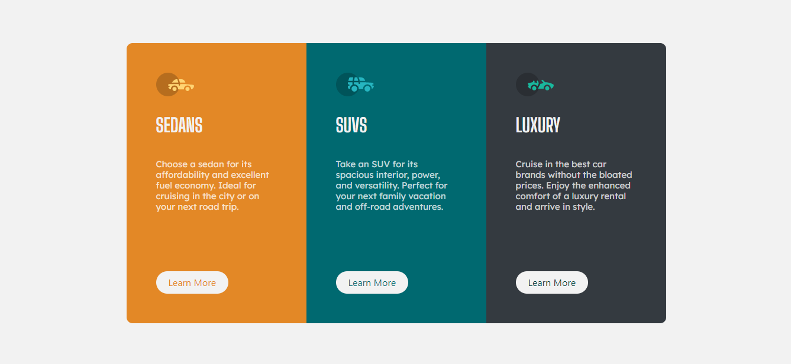

# Frontend Mentor - 3-column preview card component solution

This is a solution to the [3-column preview card component challenge on Frontend Mentor](https://www.frontendmentor.io/challenges/3column-preview-card-component-pH92eAR2-). Frontend Mentor challenges help you improve your coding skills by building realistic projects.

## Table of contents

- [Overview](#overview)
  - [The challenge](#the-challenge)
  - [Screenshot](#screenshot)
  - [Links](#links)
- [My process](#my-process)
  - [Built with](#built-with)
  - [What I learned](#what-i-learned)
  - [Continued development](#continued-development)
  - [Useful resources](#useful-resources)
- [Author](#author)
- [Acknowledgments](#acknowledgments)

## Overview

### The challenge

Users should be able to:

- View the optimal layout depending on their device's screen size
- See hover states for interactive elements

### Screenshot

### Links

- Solution URL: [Add solution URL here](https://www.frontendmentor.io/solutions/3columnpreviewcardcomponent-bootstrap-flex-0dIhtGEDs)
- Live Site URL: [Add live site URL here](https://maxi-rpc.github.io/Challenges-Web-2/)

## My process

### Built with

- Semantic HTML5 markup
- CSS custom properties
- Flexbox
- CSS Grid
- Mobile-first workflow
- [Styled Components](https://getbootstrap.com/docs/4.6/getting-started/introduction/) - For styles

### What I learned

I continue practicing layout for frontend web developer

### Continued development

I will continue to learn the way of the front and a lot of javascript especially react

### Useful resources

- [Example resource 1](https://hackerthemes.com/bootstrap-cheatsheet/) - This helped me for components reason. I really liked this pattern and will use it going forward.

## Author

- Website - [Maximiliano Miranda](https://www.your-site.com)
- Frontend Mentor - [@Maxi-rpc](https://www.frontendmentor.io/profile/Maxi-rpc)
